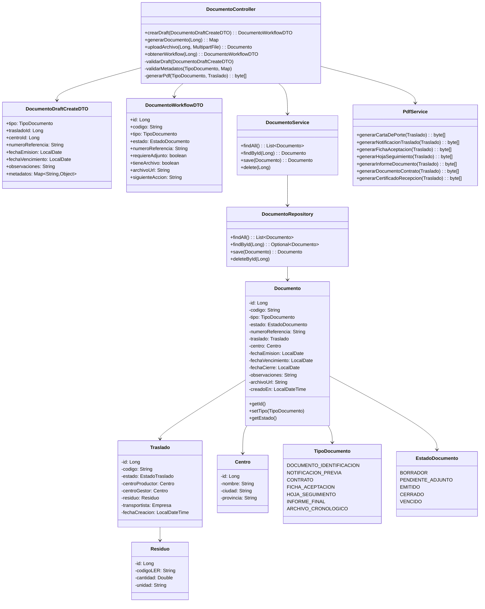
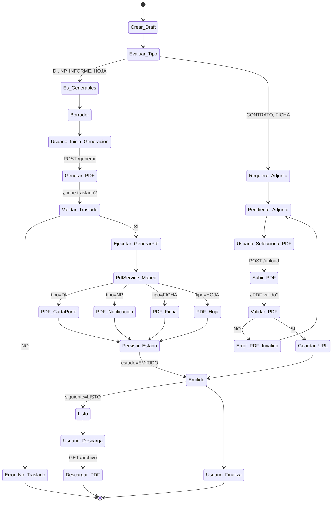
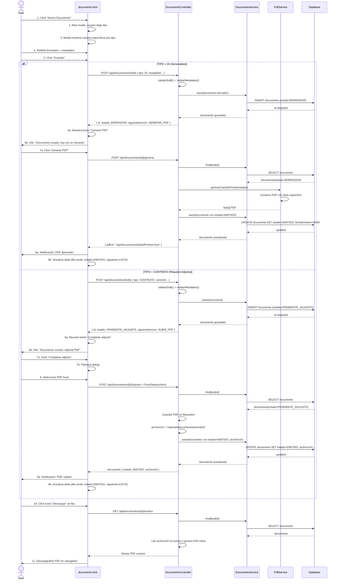
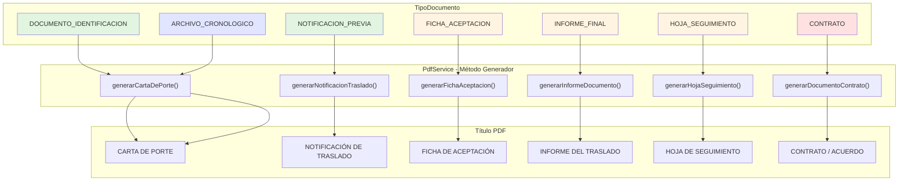
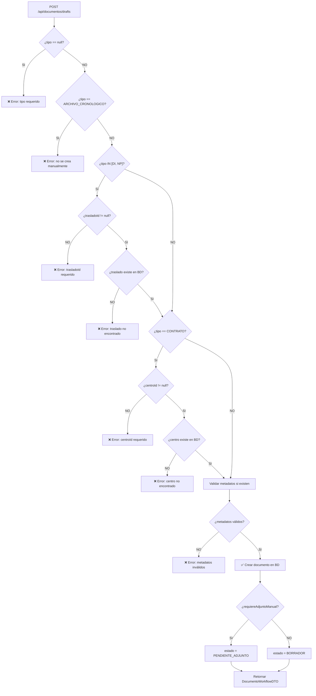

# Documentos Fase 19 - Diseño Técnico

## 1. Diagrama de Entidad-Relación (Base de Datos)

```mermaid
erDiagram
    DOCUMENTOS ||--o{ TRASLADOS : "traslado_id"
    DOCUMENTOS ||--o{ CENTROS : "centro_id"
    TRASLADOS ||--|| CENTROS : "centro_productor_id"
    TRASLADOS ||--|| CENTROS : "centro_gestor_id"
    TRASLADOS ||--|| RESIDUOS : "residuo_id"
    
    DOCUMENTOS {
        bigint id PK
        varchar codigo UK
        varchar tipo ENUM "DOCUMENTO_IDENTIFICACION|NOTIFICACION_PREVIA|CONTRATO|FICHA_ACEPTACION|HOJA_SEGUIMIENTO|INFORME_FINAL|ARCHIVO_CRONOLOGICO"
        varchar estado ENUM "BORRADOR|PENDIENTE_ADJUNTO|EMITIDO|CERRADO|VENCIDO"
        varchar numero_referencia
        date fecha_emision
        date fecha_vencimiento
        date fecha_cierre
        varchar observaciones
        varchar archivo_url
        timestamp creado_en
    }
    
    TRASLADOS {
        bigint id PK
        varchar codigo UK
        varchar estado ENUM "PENDIENTE|EN_TRANSITO|COMPLETADO|RECHAZADO"
        timestamp fecha_creacion
        timestamp fecha_inicio_transporte
        timestamp fecha_entrega
        varchar observaciones
    }
    
    CENTROS {
        bigint id PK
        varchar nombre
        varchar codigo_postal
        varchar ciudad
        varchar provincia
    }
    
    RESIDUOS {
        bigint id PK
        varchar codigo_ler
        varchar descripcion
        double cantidad
        varchar unidad
        varchar estado
    }
```

---

## 2. Diagrama de Clases (Arquitectura)



---

## 3. Diagrama de Flujo del Workflow (Estados y Transiciones)



---

## 4. Flujo End-to-End del Usuario (Escenarios)



---

## 5. Mapeador de Tipos a Generadores PDF



**Leyenda:**
- 🟢 Verde: Documentos generables (GENERABLES)
- 🟠 Naranja: Documentos con ambigüedad actual (a refactor en segunda ola)
- 🔴 Rojo: Documentos que requieren adjunto externo (ADJUNTOS)
- 🔵 Azul: Documentos automáticos del sistema (AUTOMATICOS)

---

## 6. Validaciones y Reglas de Negocio

### Validación en Creación de Draft



---

## 7. Test E2E - Coverage

El archivo `DocumentoE2ETest.java` cubre:

| Escenario | Test | Validaciones |
|-----------|------|--------------|
| Crear + generar DI | `testCrearYGenerarDI()` | Draft → BORRADOR → generar → EMITIDO |
| Crear + generar NP | `testCrearYGenerarNP()` | NP con metadatos → generación |
| Crear CONTRATO | `testCrearContratoConAdjunto()` | PENDIENTE_ADJUNTO → NO permite generar |
| Validación de requeridos | `testDIsinTrasladoFalla()` | DI sin trasladoId rechazada |
| ARCHIVO_CRONOLOGICO | `testArchivoCronologicoNoSeCreaManu()` | No se crea manualmente |
| Listar documentos | `testListarDocumentos()` | Múltiples estados visibles |
| Workflow endpoint | `testWorkflowEndpoint()` | API devuelve siguiente acción |
| Validación estricta de metadatos | `testValidacionMetadatosEstrict()` | cantidad debe ser numérica |
| Flujo completo E2E | `testFlujoCompletoE2E()` | crear → generar → descargar → BD |

---

## 8. Notas de Implementación

### Cambios Realizados

1. **PdfService.java**
   - Agregados 4 nuevos métodos públicos (generarFichaAceptacion, generarHojaSeguimiento, generarInformeDocumento, generarDocumentoContrato)
   - Cada método genera PDF con título específico

2. **DocumentoController.java**
   - Nuevo endpoint `POST /api/documentos/drafts` para crear drafts
   - Nuevo endpoint `POST /api/documentos/{id}/generar` para generar PDFs
   - Nuevo endpoint `GET /api/documentos/{id}/workflow` para obtener estado
   - Métodos privados `validarDraft()` y `validarMetadatos()` para validación estricta
   - `generarPdf()` remapped a métodos específicos por tipo

3. **EstadoDocumento.java**
   - Agregado estado `PENDIENTE_ADJUNTO` entre BORRADOR y EMITIDO

4. **DocumentoDraftCreateDTO.java** (nuevo record)
   - Payload para creación de draft con metadatos

5. **DocumentoWorkflowDTO.java** (nuevo record)
   - Respuesta de workflow con `siguienteAccion` clara

6. **documents.html**
   - Modal con campos dinámicos por tipo
   - Secciones de metadatos ocultas/mostradas según tipo
   - Botones de acciones ("Generar PDF", "Completar adjunto")
   - Columna "Siguiente" en tabla
   - Lógica `actualizarFormularioSegunTipo()` y `leerMetadatosPorTipo()`

### Pendiente de Segunda Ola

- [ ] Persistencia de `metadatos` como JSON en BD (tabla `documentos.metadatos TEXT`)
- [ ] Backend consume metadatos para ciertos tipos (ej. DI: calcula cantidad desde traslado + metadatos)
- [ ] UI avanzada: paso a paso wizard (tipo → formulario → adjunto/generar)
- [ ] Soporte para editar documento tras creación
- [ ] Auditoría: tabla `documento_eventos` para rastrear cambios de estado
